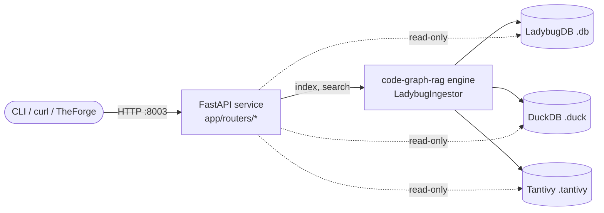

# codebase-indexer

> Ask your codebase questions. Index any repo into a typed symbol graph plus a vector store, then query it from the shell or over HTTP.

[](https://www.python.org/downloads/)
[](https://fastapi.tiangolo.com/)
[](https://github.com/astral-sh/ruff)
[](#license)

`codebase-indexer` is a FastAPI gateway and CLI that indexes source repositories into a [tree-sitter](https://tree-sitter.github.io/)–parsed symbol graph (LadybugDB, an embedded kuzu fork — no Docker) backed by a DuckDB vector store. It is powered by the [`code-graph-rag`](https://github.com/nrmeyers/code-graph-rag) engine and supports 12 languages out of the box (Python, JavaScript, TypeScript, TSX, Rust, Go, Scala, Java, C++, C#, PHP, Lua).

Use it standalone from your shell, or embed it as a sidecar — the same HTTP surface drives both.

You can ask it things like:

- "Where is `process_file` defined and who calls it?"
- "Find the auth handler" — semantic search over symbols.
- "Show me every function downstream of `httpClient.send`."
- "Give me a grounded context bundle for _add retry logic to the HTTP client_."
- "What does this Cypher query return against the repo graph?"

---

## Contents

- [Quickstart](#quickstart)
- [Demo](#demo)
- [Why not grep](#why-not-grep)
- [Two ways to use it](#two-ways-to-use-it)
- [Standalone CLI](#standalone-cli)
- [REST API](#rest-api)
- [Architecture](#architecture)
- [Configuration](#configuration)
- [Development](#development)
- [License](#license)

---

## Quickstart

```bash
uv tool install git+https://github.com/nrmeyers/codebase-indexer.git   # or: pipx install …
code-indexer setup                       # one-time interactive wizard
code-indexer index ~/path/to/your/repo   # indexes in the background, polls to completion
code-indexer search "where is the auth code"
code-indexer callers myproject.parser.process_file
```

> **STOP — semantic search needs an embedder backend.**
>
> The default `EMBEDDER_BACKEND=local` ships with the default install — a
> `uv tool install` / `pipx` install (or `uv sync` from a clone) already
> bundles sentence-transformers, so it works out of the box. If the embedder
> is missing,
> the indexer will boot but every `/search/semantic` call returns 503 with
> `in-process embedder not initialised`, and `GET /health` will show
> `embedder.available: false` (look for the loud startup banner).
>
> Pick **one** of the four paths before you start indexing:
>
> ```bash
> # 1. Local dev (recommended for new contributors)
> uv sync
>
 # 2. production (AWS SageMaker Serverless Inference — E5)
> uv sync && export AWS_PROFILE=... EMBEDDER_BACKEND=sagemaker \
>            SAGEMAKER_ENDPOINT_NAME=<your-e5-sagemaker-endpoint>
>
> # 3. GPU box without AWS (Hugging Face TEI sidecar)
> uv sync && export EMBEDDER_BACKEND=tei TEI_URL=http://localhost:8080
>
> # 4. BYO OpenAI key
> uv sync --extra byo && export EMBEDDER_BACKEND=openai OPENAI_API_KEY=sk-...
> ```
>
> Verify after the daemon starts (`code-indexer start`, or `uvicorn app.main:app` from a clone):
>
> ```bash
> curl -s http://localhost:8003/health | jq .embedder
> # Expected: { "backend": "local", "available": true, "configured": true, "dim": 768, ... }
> ```
>
> If `available` is `false`, look for the startup banner — it prints the
> exact `last_error` (e.g. `ModuleNotFoundError: No module named
> 'sentence_transformers'`) and the fix. See
> [`docs/EMBEDDERS.md`](docs/EMBEDDERS.md) for full troubleshooting.

The CLI auto-starts the FastAPI service in the background on first use. To run the HTTP gateway directly, see [Standalone CLI § serve](#cli-reference).

---

## Demo

> _Screencast coming — drop an asciinema or `vhs`-generated GIF here when one is recorded._

---

## Why not grep

`grep` and your IDE's "Find Usages" both top out where this tool starts:

- **Semantic, not lexical.** Query "the auth handler" without knowing the function is called `verify_session_token`. Backed by 768-dim [`nomic-ai/nomic-embed-text-v1.5`](https://huggingface.co/nomic-ai/nomic-embed-text-v1.5) embeddings (across `local` / `tei` / `sagemaker`) stored in DuckDB.
- **Cross-file and cross-repo by default.** Imports, calls, inheritance, and references are first-class graph edges. Ask "who calls X" across the entire indexed corpus, not just the current file.
- **Structural Cypher queries.** The symbol graph is queryable directly — return every `Function` that imports from a given module, list all `Class` nodes with more than 20 methods, etc.
- **Grounded context bundles for LLMs.** `/context-bundle` returns the symbols, snippets, and call graph relevant to a task — primary use case is feeding a coding agent without dumping whole files.

---

## Ecosystem

`codebase-indexer` is part of a three-repo orbit centered on [TheForge](https://github.com/nrmeyers/TheForge):

| Service | Role | Repo | Default port |
|---------|------|------|-------------|
| **TheForge** | Governed delivery hub + AI orchestrator | [nrmeyers/TheForge](https://github.com/nrmeyers/TheForge) | 3001 (API), 3000 (UI) |
| **codebase-indexer** | Repo graph + semantic search sidecar | [nrmeyers/codebase-indexer](https://github.com/nrmeyers/codebase-indexer) | 8003 |
| **agentalloy** | Skill composition engine | [ZZachary-M/agentalloy](https://github.com/ZZachary-M/agentalloy) | 47950 |

TheForge auto-starts this service via `scripts/start-indexer.sh` and proxies it under `/api/code-indexer/*`. You can also run it completely standalone — the CLI and HTTP surface work independently of TheForge.

---

## Two ways to use it

### Standalone tool

`pipx install` (or `uv sync` from a clone), `code-indexer setup`, point it at a directory. The CLI manages the service daemon, indexes repos, and wraps every endpoint. This is the path you want for personal use, evaluation, or scripting against your own repos.

### Embedded in TheForge

[TheForge](https://github.com/nrmeyers/TheForge) auto-starts this service when you run `pnpm dev` (via `scripts/start-indexer.sh`) and proxies it under `/api/code-indexer/*`. Set `CODE_INDEXER_PATH` if the service lives somewhere other than `~/codebase-indexer`. The CLI is a parallel, optional surface — it does not change any HTTP contract.

---

## Standalone CLI

### Install

```bash
# Option 1 — install onto your PATH (recommended for users); works from any dir
uv tool install git+https://github.com/nrmeyers/codebase-indexer.git
# or: pipx install git+https://github.com/nrmeyers/codebase-indexer.git

# Option 2 — from a clone (recommended for contributors)
git clone https://github.com/nrmeyers/codebase-indexer.git
cd codebase-indexer
uv sync
uv tool install --editable .     # optional: `code-indexer` on PATH
# (or just prefix commands with: uv run code-indexer ...)
```

Installed via `uv tool` / `pipx`, the CLI is **user-scoped** and runs from any
directory without scattering files into your cwd: config lives at
`${XDG_CONFIG_HOME:-~/.config}/codebase-indexer/` and the index datastore at
`${XDG_DATA_HOME:-~/.local/share}/codebase-indexer/` (an existing `./.cgr` in
the working dir is used instead, for in-place / TheForge deployments). See
[`INSTALL.md`](INSTALL.md) for the full runbook — standalone, Docker, the
`preflight`/`verify`/`doctor` checks, and the Claude harness skill.

### First run

```bash
code-indexer setup        # writes ~/.config/codebase-indexer/config.toml
code-indexer index ~/proj # auto-starts daemon, polls until done
code-indexer status       # shows daemon + indexed repos
```

### CLI reference

| Command                               | Description                                               |
| ------------------------------------- | --------------------------------------------------------- |
| `setup`                               | Interactive wizard. Writes `~/.config/codebase-indexer/config.toml`. |
| `serve [--port 8003]`                 | Run the FastAPI service in the foreground.                |
| `start`                               | Spawn the service in the background.                      |
| `stop`                                | Stop the background daemon.                               |
| `status`                              | Show daemon liveness + indexed repos.                     |
| `preflight`                           | Host-readiness checks for a standalone install (no daemon).|
| `doctor`                              | Runtime health check against the service + remediation.   |
| `verify`                              | Enumerated post-install checks (CLI, data dir, service).  |
| `index <path> [--watch] [--force]`    | Index a directory; polls until done.                      |
| `reindex <slug>`                      | Force a clean re-index of an indexed repo.                |
| `list`                                | List every indexed repo.                                  |
| `search "<query>" [-k 10] [--repo X]` | Semantic search over symbols.                             |
| `symbol <fqn> [--repo X]`             | Look up a symbol's source + location.                     |
| `callers <fqn> [--repo X]`            | Upstream callers of a symbol.                             |
| `callees <fqn> [--repo X]`            | Downstream callees of a symbol.                           |
| `bundle "<task>" --repo <path>`       | Build a grounded context bundle for an LLM.               |
| `explore`                             | Print the LadybugDB Explorer launch command + URL.        |
| `remove <slug> [-y]`                  | Delete a repo's index (cascade).                          |

Pass `--base-url` to any command to talk to a remote service; the CLI otherwise reads `[server].base_url` from the config. Pass the global `--json` flag (before the subcommand, e.g. `code-indexer --json search ...`) for machine-readable stdout when driving the CLI from a harness or agent.

### Config file

The setup wizard writes `~/.config/codebase-indexer/config.toml`:

```toml
[server]
base_url = "http://localhost:8003"
port = 8003

[embedder]
backend = "local"      # local | sagemaker | tei

[paths]
data_dir = "/Users/jane/.code-indexer"
```

Override the base URL at any time with `--base-url` or `CODE_INDEXER_BASE_URL`.

---

## REST API

The HTTP service listens on port `8000` by default when run directly (`uv run uvicorn app.main:app`), or `8003` when launched by the CLI to match TheForge's proxy.

> **Security — bind host defaults to loopback.** Running `python main.py` binds
> the server to `127.0.0.1` (loopback only). The service has **no
> path-level authentication**, so binding to all interfaces (`0.0.0.0`) on a
> Tailscale-connected or LAN-reachable host exposes the full index/search/admin
> surface to anyone who can reach the IP. TheForge proxies the service over
> `http://localhost:8003`, so the loopback default is transparent to TheForge.
> To listen on all interfaces deliberately (containers, multi-host deploys),
> set `INDEXER_HOST=0.0.0.0` (or `HOST=0.0.0.0`). The production Docker image's
> `CMD` already passes `--host 0.0.0.0` explicitly, and the CLI `serve` /
> daemon paths pass `--host 127.0.0.1` explicitly — both override this default
> and are unaffected by the change.

Full schema lives at `GET /openapi.json`. The most-used endpoints:

| Method   | Path                     | Description                                             |
| -------- | ------------------------ | ------------------------------------------------------- |
| `GET`    | `/health`                | Liveness + list of indexed repos.                       |
| `POST`   | `/index`                 | Start a background index job. Returns `202` + `job_id`. |
| `GET`    | `/index/{job_id}/status` | Poll job progress.                                      |
| `POST`   | `/index/{job_id}/cancel` | Cancel a running job.                                   |
| `GET`    | `/index/jobs`            | List background jobs.                                   |
| `GET`    | `/search/semantic?q=&k=` | Vector-similarity search.                               |
| `GET`    | `/search/structural?q=`  | Arbitrary Cypher against LadybugDB.                     |
| `GET`    | `/search/lexical?q=`     | BM25 search via Tantivy.                                |
| `GET`    | `/search/symbol?fqn=`    | Exact FQN lookup.                                       |
| `GET`    | `/search/centrality`     | PageRank scores over the whole graph (any-repo).        |
| `GET`    | `/search/graph/overview` | Layer/cluster overview for graph visualisation.         |
| `GET`    | `/symbols/{fqn}/callers` | Upstream callers of a fully-qualified symbol.           |
| `GET`    | `/symbols/{fqn}/callees` | Downstream callees of a fully-qualified symbol.         |
| `GET`    | `/symbols/{fqn}`         | Symbol source + location by FQN.                        |
| `GET`    | `/repos/{name}/centrality` | Per-repo PageRank top-N (5-min cache for TheForge boost). |
| `GET`    | `/search/files`          | Browse the package/file tree.                           |
| `GET`    | `/search/types`          | Enumerate node labels + counts.                         |
| `POST`   | `/context-bundle`        | Grounded context for a task description.                |
| `GET`    | `/repos`                 | List all indexed repos.                                 |
| `GET`    | `/repos/{name}/stats`    | Node, relationship, and embedding counts.               |
| `POST`   | `/repos/{name}/reindex`  | Force re-index.                                         |
| `DELETE` | `/repos/{name}`          | Remove a repo from the index.                           |
| `GET`    | `/explorer/info`         | LadybugDB Explorer launch command.                      |
| `GET`    | `/metrics`               | Prometheus metrics.                                     |

### Examples

Start an index job:

```bash
curl -sX POST http://localhost:8000/index \
     -H 'content-type: application/json' \
     -d '{"repo_path": "/abs/path/to/repo"}'
# → {"job_id": "3f2a…", "status": "running"}
```

Poll until done:

```bash
curl -s http://localhost:8000/index/3f2a…/status
# → {"status": "done", "progress_pct": 100, "node_count": 1842, "rel_count": 3107, "embedding_count": 892}
```

Semantic search:

```bash
curl -s 'http://localhost:8000/search/semantic?q=session+token+validation&k=5'
```

Cypher passthrough:

```bash
curl -s --data-urlencode 'q=MATCH (f:Function)-[:CALLS]->(g:Function) RETURN f.qualified_name, g.qualified_name LIMIT 10' \
     http://localhost:8000/search/structural
```

Grounded context bundle:

```bash
curl -sX POST http://localhost:8000/context-bundle \
     -H 'content-type: application/json' \
     -d '{"repo_path": "/abs/path/to/repo", "task_description": "add retry logic to the HTTP client", "depth": 2}'
```

---

## Startup Performance Optimizations

Three latency taxes are paid once at `uvicorn` startup so they are never charged to user-facing requests.

**PageRank centrality precompute.** At the end of every index job the Plan J block runs a single PageRank pass over the LadybugDB CALLS graph and persists the normalized scores into the `centrality` table of the per-repo `.duck` DuckDB file. `GET /repos/{name}/centrality` is therefore a pure `SELECT … ORDER BY pagerank DESC LIMIT ?` — sub-millisecond regardless of repo size. The `last_computed_at` field in the response tells TheForge's orchestrator whether its 5-minute in-memory cache is still fresh relative to the last index run (BUC-1577).

**Embedder model warmup (Phase 5).** On startup, a daemon thread issues a single `"warmup"` embed call through whichever backend is configured (`local` / `sagemaker` / `tei`). This absorbs the SageMaker Serverless cold-start (~4–5 s observed) and the `sentence-transformers` model-load time before any search request arrives. The warmup is non-fatal: a broken or unconfigured embedder is logged at DEBUG level and startup continues normally.

**Tantivy segment warm-up (Phase 9).** A second daemon thread iterates all existing `<slug>.tantivy/` directories under `LADYBUG_DB_DIR` and calls `Index.reload()` on each, paging the segment mmaps into the OS buffer cache. Without this, the first BM25 lexical search on a large repo pays 200–800 ms of page faults. The warmup is non-fatal: missing tantivy bindings or corrupt segment directories are silently skipped.

---

## Architecture

### Ingest → query flow

```mermaid
flowchart TD
    subgraph Ingest["POST /index → background job"]
        SRC([source repo]) -->|walk files| TS[tree-sitter parser\n12 languages]
        TS -->|typed nodes + edges| LB[(LadybugDB\n.cgr/repos/slug.db\nCypher graph)]
        TS -->|symbol text| EMB{Embedder backend}
        EMB -->|local| LOC[sentence-transformers\nin-process]
        EMB -->|sagemaker| SM[AWS SageMaker\nServerless Inference]
        EMB -->|tei| TEI[HF Text-Embeddings-Inference\nHTTP sidecar]
        LOC & SM & TEI -->|FLOAT[768] vectors| DD[(DuckDB\n.cgr/repos/slug.duck\nvector store)]
        TS -->|token index| TAN[(Tantivy\nslug.tantivy\nBM25 lexical)]
        LB -->|PageRank pass| CR[(centrality table\nDuckDB)]
    end

    subgraph Query["GET /search/* · POST /context-bundle"]
        Q([query]) -->|semantic| DD
        Q -->|structural Cypher| LB
        Q -->|BM25 lexical| TAN
        Q -->|FQN lookup| LB
        Q -->|context bundle| CB[merge + rerank\nhydrate snippets]
        DD & LB & TAN --> CB
        CB -->|grounded symbols| OUT([LLM-ready context])
    end
```

### Component overview



- **Parsing.** [tree-sitter](https://tree-sitter.github.io/) grammars for 12 languages: Python, JavaScript, TypeScript, TSX, Rust, Go, Scala, Java, C++, C#, PHP, and Lua. Symbols (functions, classes, methods), files, modules, and references become typed graph nodes.
- **Graph store.** [LadybugDB](https://docs.ladybugdb.com/) — an embedded, file-backed [kuzu](https://kuzudb.com/) fork. One `.db` file per repo at `.cgr/repos/<slug>.db`. Cypher-queryable. No Docker.
- **Vector store.** DuckDB `FLOAT[768]` column plus `array_cosine_distance` for similarity search. One `.duck` file per repo at `.cgr/repos/<slug>.duck`.
- **Embedders.** Four interchangeable backends behind a single `EmbedderBackend` protocol. The three "native" backends all produce 768-dim `nomic-ai/nomic-embed-text-v1.5` vectors (`local` / `tei` / `sagemaker`) so the on-disk index shape is portable across them — but indexes built under one model are NOT interchangeable with another. (Model timeline: `intfloat/e5-base-v2` → a 2026-05-26 swap to `jinaai/jina-code-embeddings-v2` benchmarked and **reverted** — 16% vs 83% recall@5 on the golden set, see LE-144 → `nomic-ai/nomic-embed-text-v1.5` **adopted after the 768-dim POC**: +3.9pp recall@10 over e5, same FLOAT[768] schema.) A fourth backend, `openai`, is the bring-your-own path (1536 or 3072 dim — needs a re-index). Switch with `EMBEDDER_BACKEND={local|sagemaker|tei|openai}` and restart. See [`docs/EMBEDDERS.md`](docs/EMBEDDERS.md).
- **Imports across repos.** Cross-repo `IMPORTS` edges link symbols indexed under different slugs (BUC-1598).
- **Centrality.** PageRank scores over the call/import graph are precomputed and exposed at `/search/centrality` (BUC-1577, BUC-1599 persistence).

---

## Configuration

### Environment variables

| Variable                  | Default                 | Description                                                      |
| ------------------------- | ----------------------- | ---------------------------------------------------------------- |
| `LADYBUG_DB_DIR`          | `.cgr/repos`            | Per-repo `.db` + `.duck` storage root.                           |
| `LADYBUG_DB_PATH`         | _(legacy)_              | Single-DB fallback for direct `code-graph-rag` callers.          |
| `LADYBUG_BATCH_SIZE`      | `1000`                  | Ingestor flush batch size.                                       |
| `KUZU_BUFFER_POOL_SIZE`   | `2147483648` (2 GiB)    | Bounded LadybugDB/Kùzu buffer-pool size in **bytes**. The engine's default (`0`) auto-sizes to ~80% of physical RAM and over-reserves; on a memory-pressured box (e.g. co-tenanted with a large local LLM) the mmap fails (`Buffer manager exception: Mmap for size … failed`) and **all** graph/structural/path queries break for every repo until restart. Every `Database` open passes this explicit bound so it degrades gracefully. Invalid / `0` / negative values fall back to the 2 GiB default. |
| `TARGET_REPO_PATH`        | `.`                     | Default repo when a request omits `repo_path`.                   |
| `INDEXER_HOST` / `HOST`   | `127.0.0.1`             | HTTP bind address. **Loopback-only by default** (see security note below). `INDEXER_HOST` takes precedence over `HOST`. Set to `0.0.0.0` to listen on all interfaces (containers / multi-host deploys). |
| `PORT`                    | `8000`                  | HTTP bind port.                                                  |
| `EMBEDDER_BACKEND`        | `local`                 | One of `local`, `sagemaker`, `tei`, `openai`.                    |
| `LOCAL_EMBED_MODEL`       | `nomic-ai/nomic-embed-text-v1.5` | Override only after re-indexing.                                 |
| `SAGEMAKER_ENDPOINT_NAME` | —                       | Required when `EMBEDDER_BACKEND=sagemaker`.                      |
| `SAGEMAKER_EMBED_REGION`  | `us-east-1`             | AWS region for the SageMaker endpoint.                           |
| `TEI_URL`                 | `http://localhost:8080` | Endpoint for the TEI sidecar.                                    |
| `TEI_TIMEOUT_MS`          | `30000`                 | Per-request TEI timeout.                                         |
| `OPENAI_API_KEY`          | —                       | Required when `EMBEDDER_BACKEND=openai`.                         |
| `OPENAI_EMBED_MODEL`      | `text-embedding-3-small`| `text-embedding-3-small` (1536) or `text-embedding-3-large` (3072). |
| `OPENAI_EMBED_DIM`        | —                       | Matryoshka truncation (3-series only); blank → native dim.       |
| `OPENAI_BASE_URL`         | —                       | Override for Azure / vLLM / LiteLLM gateways.                    |
| `RERANK_ENABLED`          | `false`                 | Opt into the future rerank stage (see `docs/SEARCH_RANKING.md`). |
| `GITHUB_TOKEN`            | —                       | Fine-scoped PAT for `/github/*` routes.                          |
| `JOB_HEARTBEAT_INTERVAL_SECONDS` | `60`             | Interval of the background reconciler that fails orphaned/hung running jobs and releases their per-repo lock. Min 10s. |
| `JOB_STALENESS_THRESHOLD_SECONDS` | `300`           | A running job whose progress heartbeat (`last_progress_at` / durable `updated_at`) hasn't advanced within this window is treated as hung and failed. **Writing-phase aware:** a job in `phase=='writing'` (the callback-silent Kùzu bulk flush, which can run for minutes on a large repo) is held to the wider `JOB_PHASE_WATCHDOG_SECONDS` budget instead, and a 30s heartbeat thread keeps its liveness fresh during the flush — so a healthy slow write is never reaped mid-write (which previously left a partial graph with missing route handlers / a degenerate single mega-cluster in the KG viewer). |
| `JOB_PHASE_WATCHDOG_SECONDS` | `600`                | Wider no-progress budget used on the request/delete reconcile paths and (since the write-stall fix) as the staleness budget while a job is in the `writing` phase. A genuinely dead worker stuck in `writing` past this is still reaped. |

Copy [`.env.example`](.env.example) to `.env` and adjust paths for your machine. The example file documents every variable inline.

### Embedder backends

| Backend     | Default model              | Dim   | When to use                                | Tradeoffs                                                        |
| ----------- | -------------------------- | ----- | ------------------------------------------ | ---------------------------------------------------------------- |
| `local`     | `nomic-ai/nomic-embed-text-v1.5` | 768 | Standalone / laptop / no AWS. **Default.** | ~520 MB model download on first run; CPU-bound; zero infra cost. |
| `sagemaker` | `nomic-ai/nomic-embed-text-v1.5` | 768 | production. (Timeline: e5 → jina swap 2026-05-26 reverted LE-144 → nomic-v1.5 adopted after the 768-dim POC, +3.9pp recall@10 over e5.) | GPU-backed batching; requires AWS creds; per-invocation cost.    |
| `tei`       | `nomic-ai/nomic-embed-text-v1.5` | 768 | Self-hosted GPU box.                       | Highest throughput; one extra container; no AWS coupling.        |
| `openai`    | `text-embedding-3-small`   | 1536  | Bring your own — no AWS, no GPU.           | $0.02 / 1M tokens; needs `OPENAI_API_KEY`; **re-index required** (1536 ≠ 768). |

Switching among `local` / `sagemaker` / `tei` is a pure env-var flip — the DuckDB `FLOAT[768]` schema is shared. Switching to `openai` (or anywhere the dim changes) needs a fresh index because the column type doesn't match; see [`docs/EMBEDDERS.md`](docs/EMBEDDERS.md) for the recipe, cost/quality comparison, and protocol contract for plugging in your own backend.

Install the BYO extra alongside the default deps:

```bash
uv sync --extra byo              # installs openai>=1.0 for the openai backend
```

---

## Development

```bash
git clone https://github.com/nrmeyers/codebase-indexer.git
cd codebase-indexer
uv sync                          # installs everything incl. the vendored engine + local embedder
uv run uvicorn app.main:app --reload --port 8000
uv run pytest tests/ -v          # 51+ tests
uv run ruff check .              # lint
```

Tests live under `tests/` and cover routers (`tests/routers/`), services, embedders, and CLI command parsing.

---

## License

MIT. See [LICENSE](LICENSE) if present, otherwise this project is released under the [MIT License](https://opensource.org/licenses/MIT).

## Contributing

Issues and PRs welcome on [GitHub](https://github.com/nrmeyers/codebase-indexer/issues). See [`AGENTS.md`](AGENTS.md) for the conventions agents follow when working in this repo.
